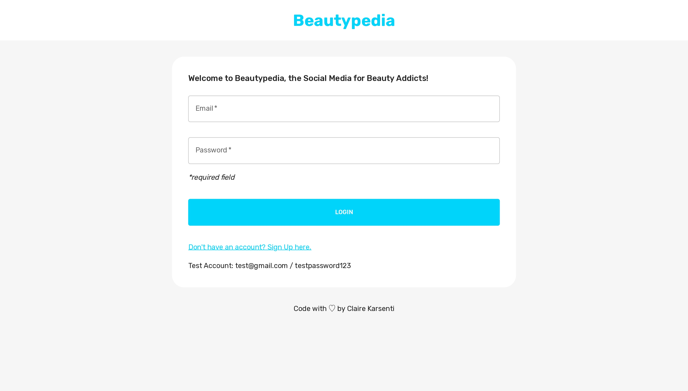
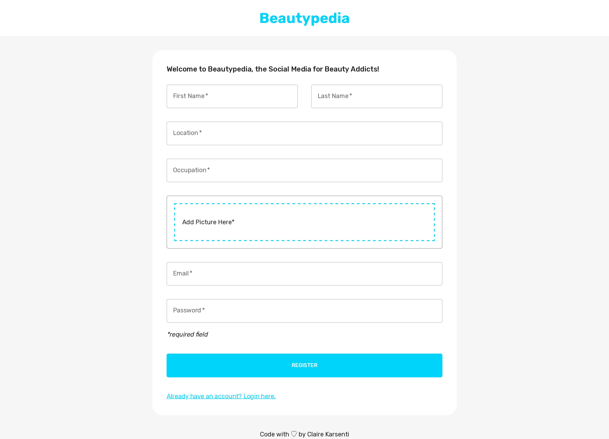
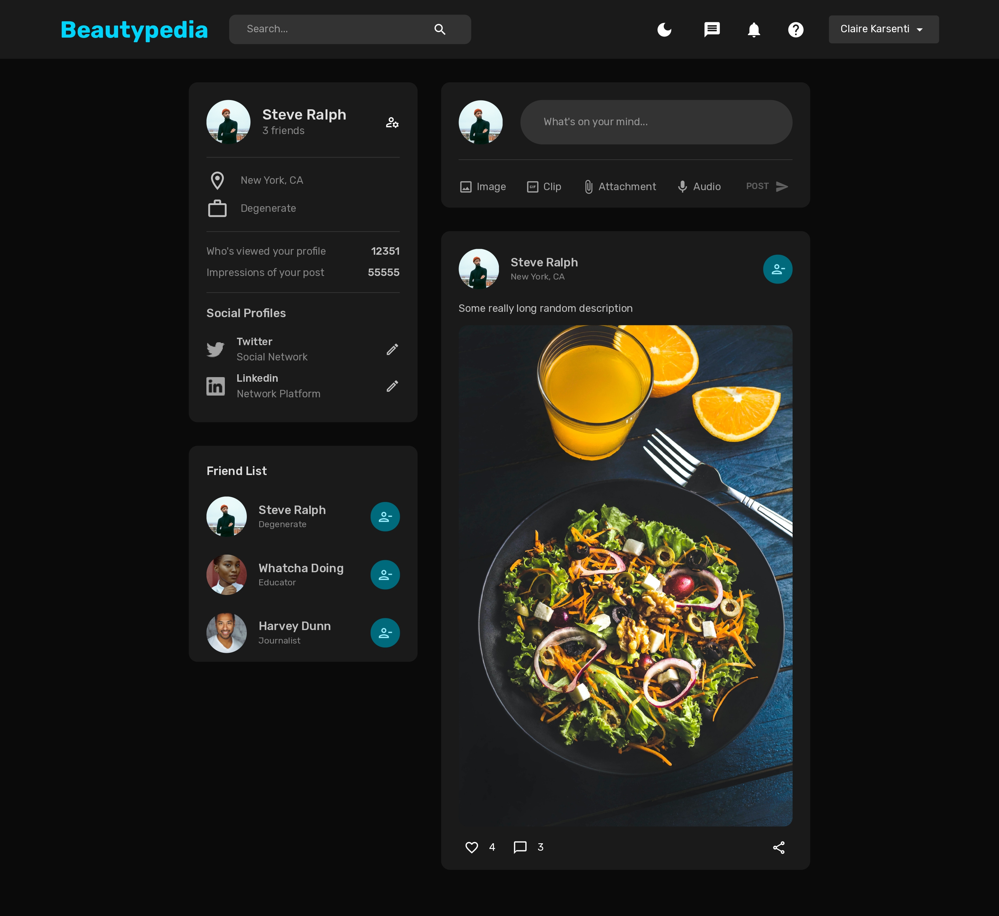

# Beautipedia - Social Media App

- [Beautipedia - Social Media App](#beautipedia---social-media-app)
  - [About the project](#about-the-project)
    - [Stack](#stack)
    - [Features](#features)
    - [Link](#link)
  - [Screenshots of the Project](#screenshots-of-the-project)
    - [Home Page](#home-page)
    - [Profile Page](#profile-page)
    - [Login Page](#login-page)
    - [SignUp Page](#signup-page)
    - [Dark mode](#dark-mode)

## About the project

This immersive social platform, built with React and Material UI, empowers users to connect with friends, share special moments, and explore a world of interactive content. With a contemporary and user-friendly layout, it also offers a dark mode for the optimal user experience.

### Stack

- React
- Redux
- Material UI
- Node.js
- MongoDB

### Features

- Auth
- Dark Mode

### Link

[Beautipedia Social Media App demo](https://beautypedia-clairekarsenti.netlify.app)

## Screenshots of the Project

### Home Page

### Profile Page

### Login Page

### SignUp Page

### Dark mode

